# kottans-frontend

## Front-end stage 0 learning summaries

## [x] 0. Git Basics  

I liked that lectures are concise and included built-in tests.

The game that teaches Git was really interesting though I would love it to be less abstract 
and include some short pieces of code that are stored in example repositories we are working with
so that I could better understand the purpose behind some git commands I had to execute.

The Git is a bit overwhelming in comparison to the Mercurial which I used.

___

## [x] 1. Linux CLI, and HTTP

-  Linux CLI 

        

    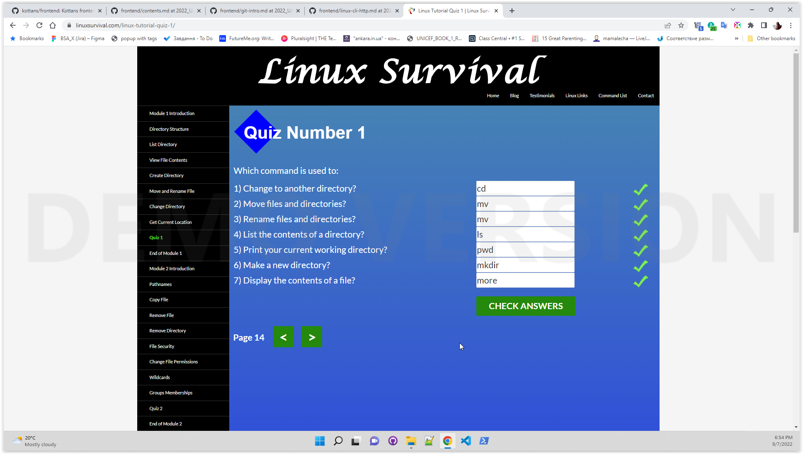
    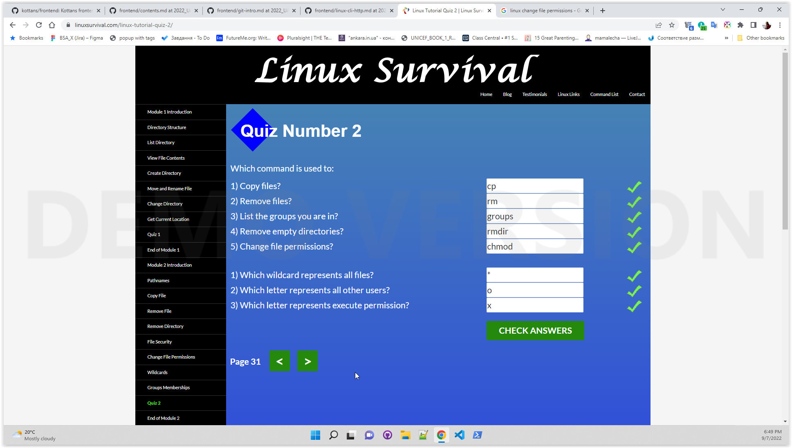
    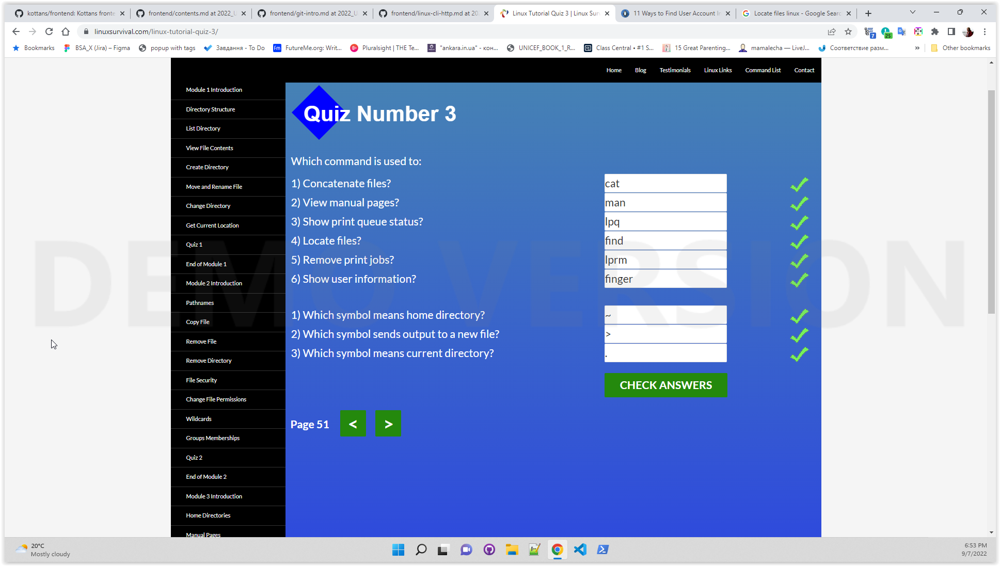
    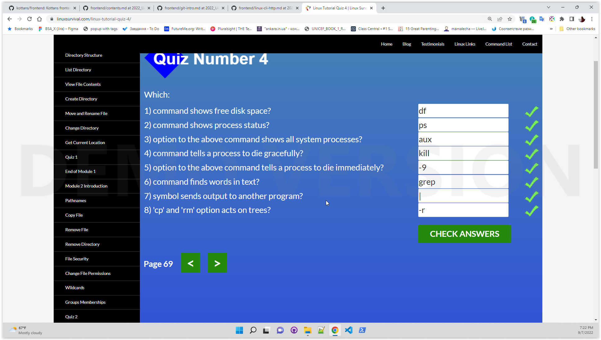
    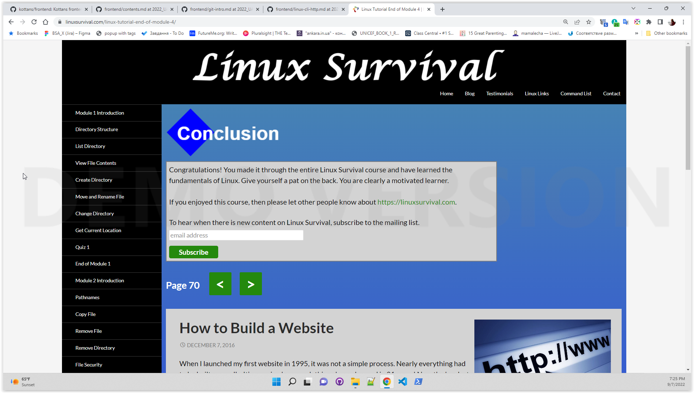

    

    
    **New:**  Since I am new to linux cli, basically all commands except for cd and mkdir were new to me.   
    **Surprised:** That a command used for moving and renaming files is the same.  
    **Plan to use:** Commands "more and find" seem to be the ones that I will use.  

- HTTP part 1  
    **New:**  The notion of multiplexing(client is able to send multiple requests simultaneously) that was introduced with version 2.0.  
    **Surprised:** Some headers are common for request and response messages. Via header where intermediate proxies or gateways inject their IP or DNS names.  
    **Plan to use:** Tools that allow to monitor HTTP communication, for example: Chrome inspector, Wireshark. 
- HTTP part 2  
    **New:**  Persistent TCP connections that were introduced in HTTP 1.1 that stay open until client closes them and can be reused.  The notion of Fat URLs, Digest Authentication, pool of connections.  
    **Surprised:**  Multiple caching proxies, Cache-control header values.  
    **Plan to use:** Cookies, cache, basic authentication.

___

## [x] 2. Git Collaboration

- Learn branching 

    

    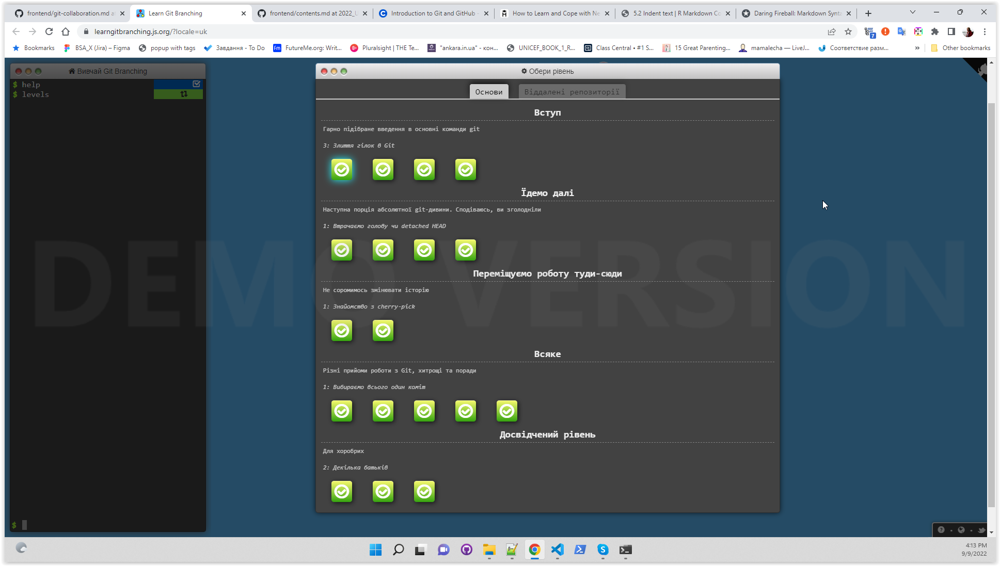
    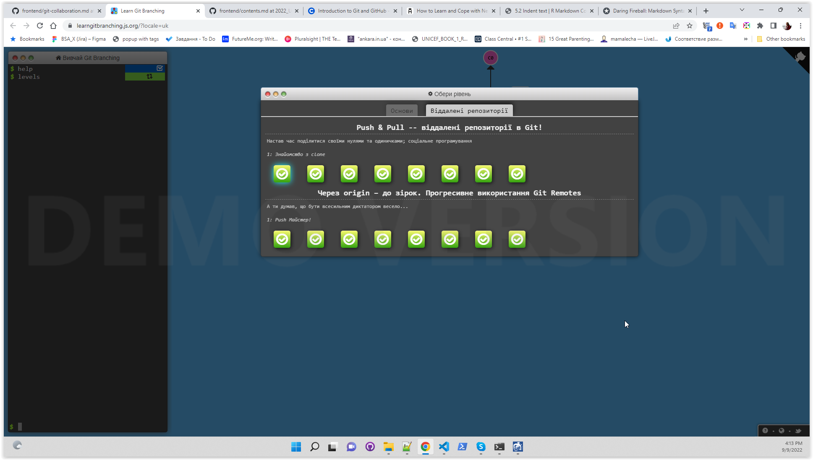
 **New:** Git tags, rebase.  
    **Surprised:** Local main branch is not necessarily directly mapped to the remote main branch. The obsession with keeping commit history clean hence avoiding merge commits.     
    **Plan to use:** Cherry-pick.
- Git and github 

    

    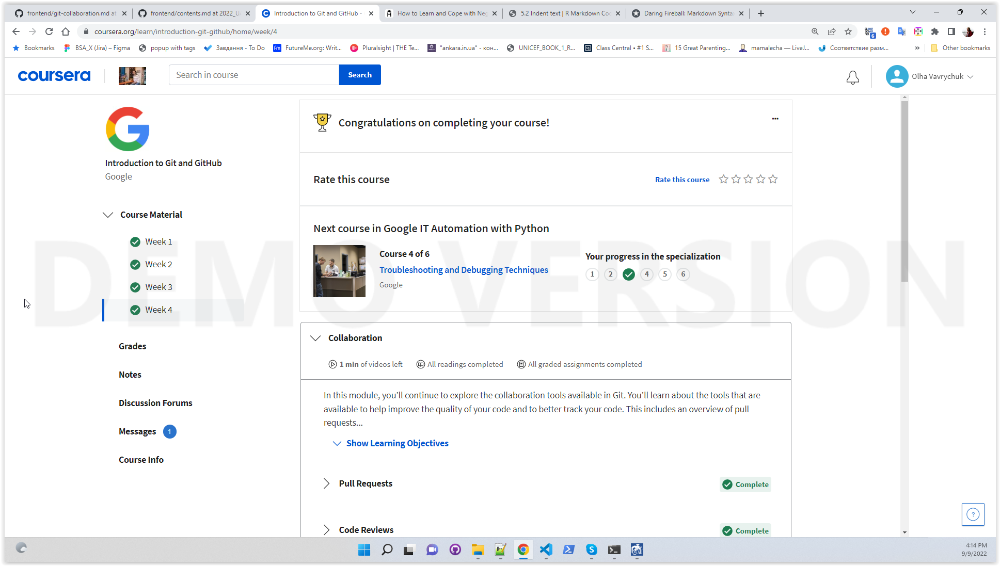

    **New:**  Squashing commits, rebasing.  
    **Surprised:**  Squashing commits.  
    **Plan to use:**  Well, eventually everything.

___

## [x] 3. Intro to HTML and CSS

- Intro to HTML & CSS

    

    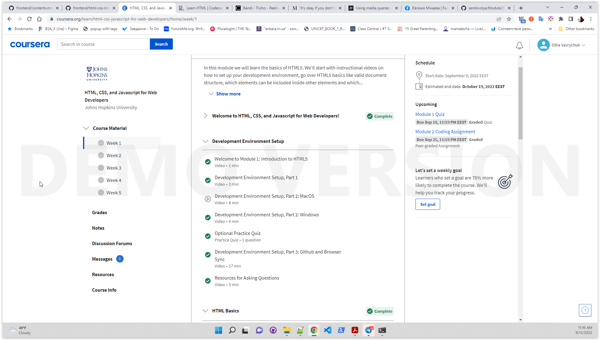
    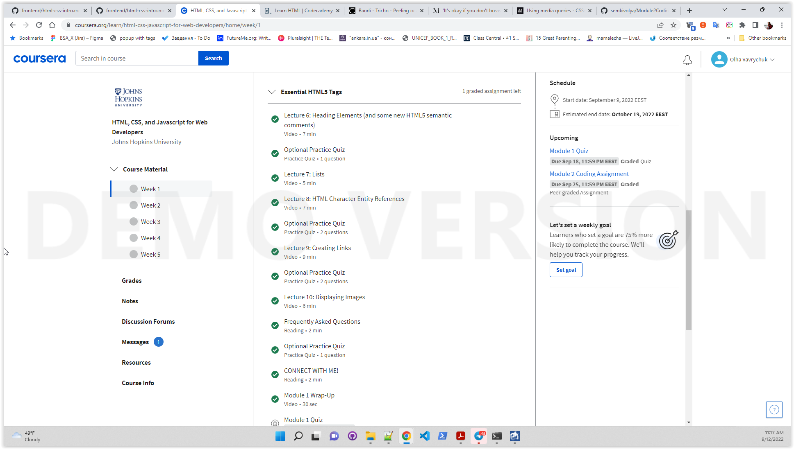
    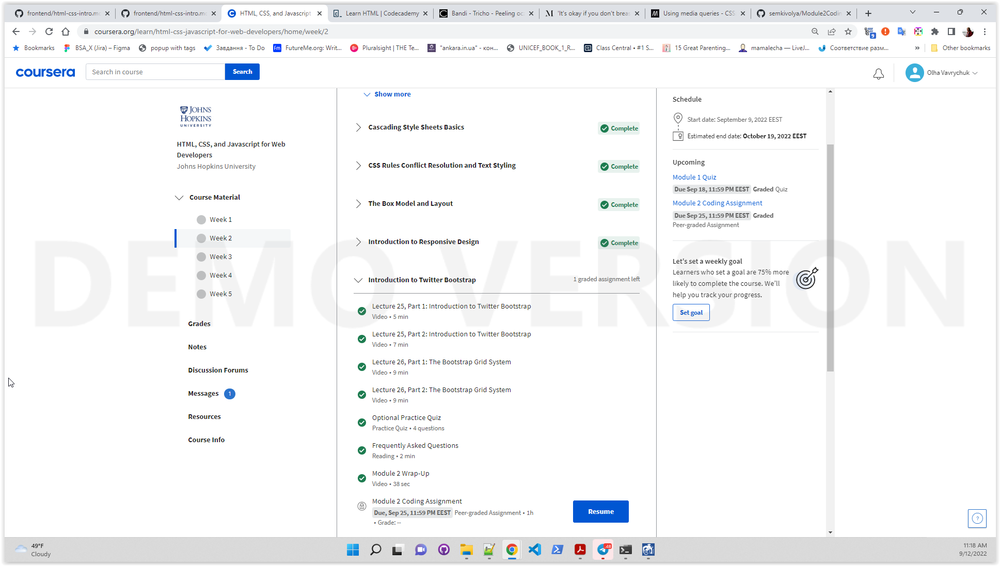

    
    https://semkivolya.github.io/Module2CodingAssignment/

    **New:**  Implementation details of bootstrap grid system. Box-sizing is not inherited. Vertical margins of floated elements do not collapse. And finally I have understood the notion of 'clear' property.  
    **Surprised:**  The exercises are surprisingly good: they make you think and help to better remember information.  
    **Plan to use:** Bootstrap for quick and easy layout.

- Learn HTML 

    

    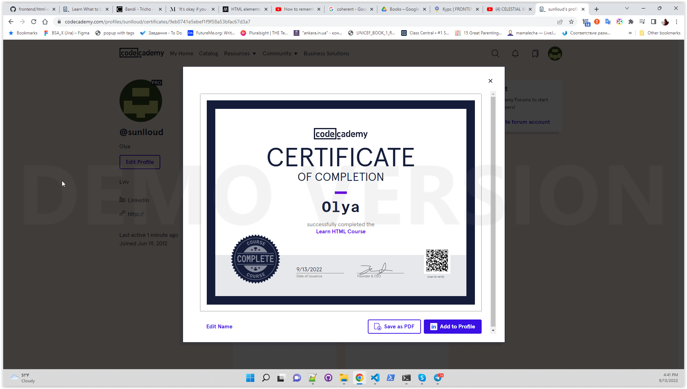
    

    **New:** Datalist element.  
    **Surprised:** -   
    **Plan to use:** Everything.

- Learn CSS 

    

    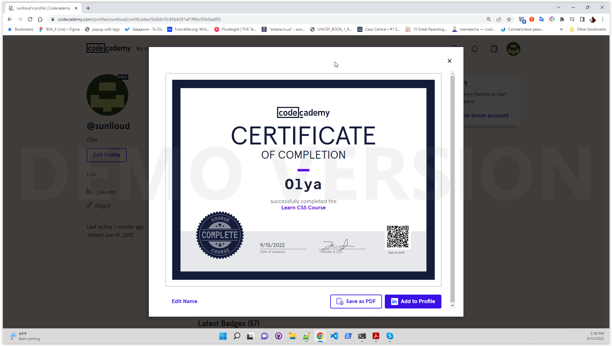
    

    **New:** Position 'sticky'.  
    **Surprised:** Floated elements must have width specified.   
    **Plan to use:** Everything.

___
## [x] 4. Responsive Web Design

- Responsive web design basics

    **New:**  By default mobile browsers render pages at desktop width. You can easily view media query breakpoints in developer tools.  
    **Surprised:** In landscape mode some browsers do not change page\`s width.   
    **Plan to use:** Setting image`s max-width to 100%. Setting viewport meta tag.

- FLEXBOX. Вчимося верстати на флексах

    **Summary:** Will rewatch multiple times, especially the last video with real project.  

- Flexbox froggy 

    

    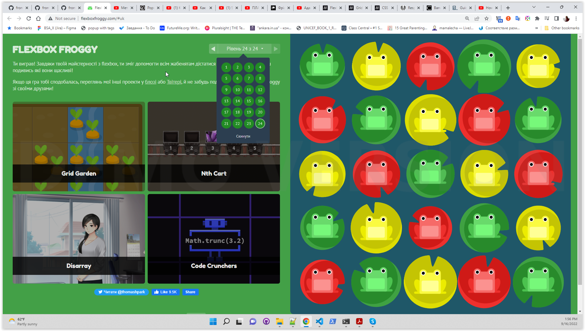
    

- CSS Grid Layout

    **Summary:** Will rewatch multiple times, especially the last video with real project.  

- Grid Garden 

    

    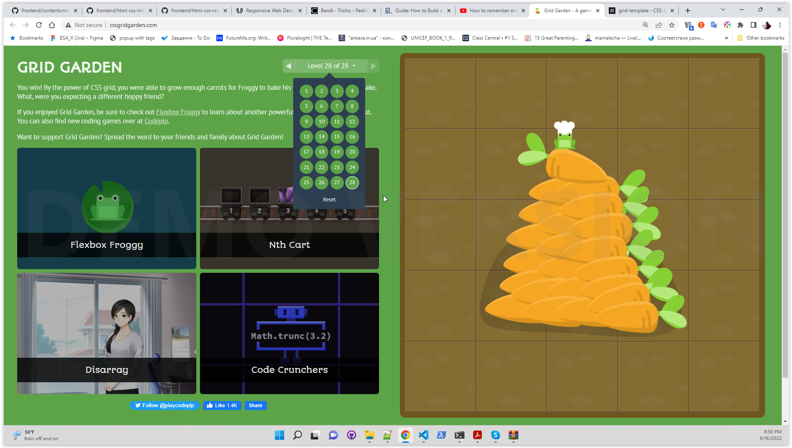
    

    __

## [x] 5. HTML & CSS Practice
  
  https://github.com/semkivolya/hooli-style-popup

  **Summary:** The most difficulty I had was with aligning images. Seems like I have to learn a bit more about it.

  